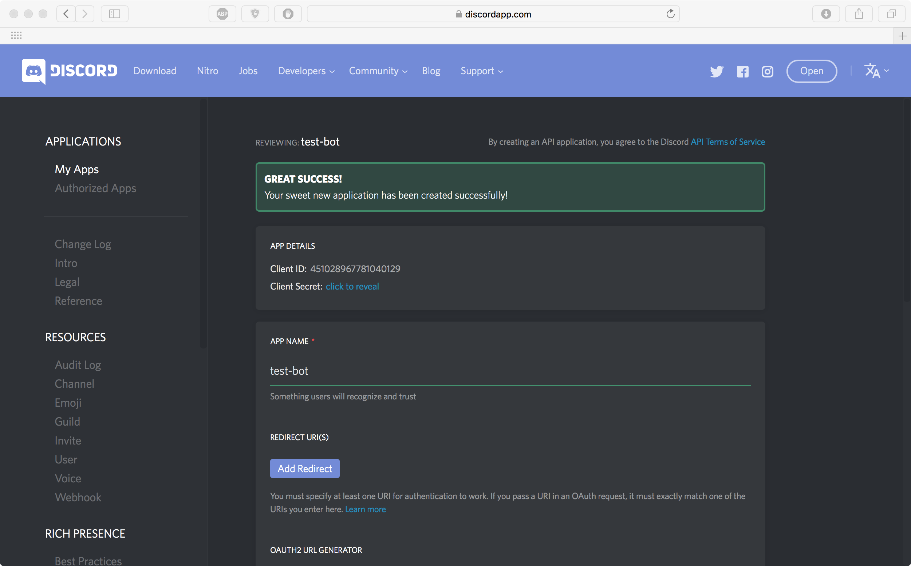
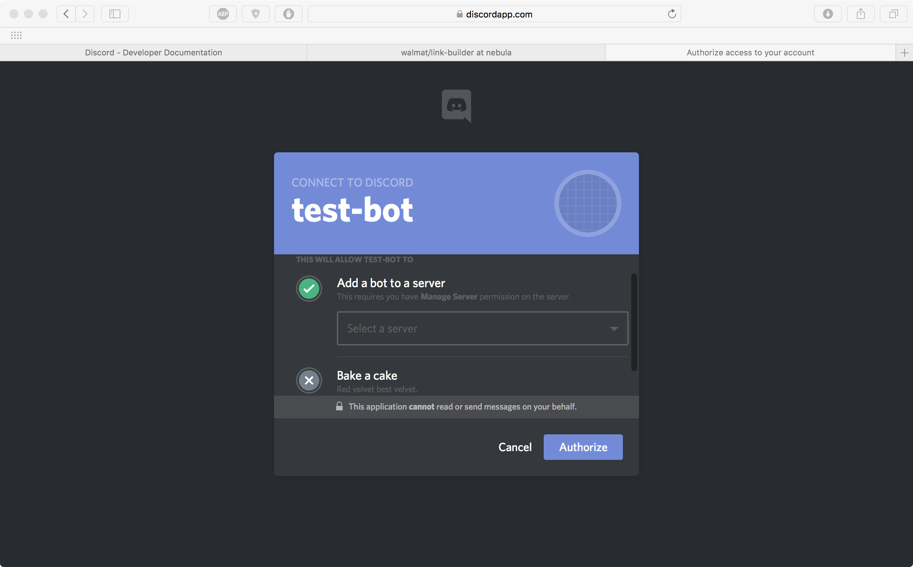
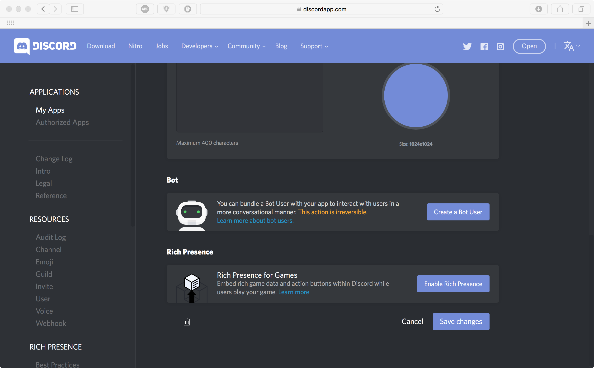

<h1 align="center">
   
  
   
  Shopify Link Builder
   
</h1>

A lightweight checkout link builder given product(s) link. Supports direct integration into [Discord](https://discordapp.com).

## Getting Started

(On Windows I like to use the Linux Terminal Emulator [Cmder](http://cmder.net))

1. `git clone https://github.com/walmat/link-builder.git`
2. `cd link-builder`
3. `npm install` (or `npm i` for all you shortcut junkies)

### Prerequisites

If you don't already have `Node` installed, head [here](https://nodejs.org/) and install the stable copy for your OS.

If you don't already have a custom bot setup for your server, navigate [here](https://discordapp.com/developers/applications/me). You should see a similar screen as below once you're logged in.

If you don't already have a bot, click `New App`. You should be redirected to the screen below.

On this screen, go ahead and give your bot a name (description and picture are optional, and can be changed later if you decide you want to add either). Click `Create App` to continue.

You'll see the screen above once your `App has been created`. Here we'll need to do a couple things. First things first,
copy the `Client ID` under `App Details`, open up a new tab, and navigate to `https://discordapp.com/oauth2/authorize?client_id=YOUR_CLIENT_ID_HERE&scope=bot`
making sure to replace `YOUR_CLIENT_ID_HERE` with the Client ID of your new application. (e.g. – for my application,
the url looks like this: `https://discordapp.com/oauth2/authorize?client_id=451028967781040129&scope=bot`).

Select the server you want to add the bot to, and click `Authorize`. You can close that page now. Let's head back to the
tab where we're setting up our bot. Scroll to the bottom of the page, and you should see the below screen.

Click on the button `Create a Bot User` and `Yes, do it!`.

Refer to the above screenshot, but we're almost done setting up the pre-requisites. Check the box next to `Public Bot`,
and click to reveal your `token`. *Keep this safe and don't share it with anyone!!*

With that token, navigate to the project directory and open `config.json` in whatever text editor you prefer (I use [sublime](https://www.sublimetext.com)).
Paste that token over the `PASTE_YOUR_TOKEN_HERE`. Save and close that file.

## Deployment

Once you have the `config.json` file finished, and if you're navigated into the `link-builder` folder already, simply
run `node index.js`. This will start the bot for you.

### Developers

If you want to further develop this project, please give credit where credit is due.

## Usage

You can choose to setup a given channel for this, but I won't go into all that babysitting here. To run the link builder,
simple type: `$build <link to product>`

For example, this will build the checkout links for [NIKE X ACRONYM AIR VAPORMAX FK MOC 2](https://kith.com/collections/footwear/products/nkaq0996-102)

`$build https://kith.com/collections/footwear/products/nkaq0996-102`. You can use as many links chained (separated by a space of course) to one `$build`
command too!
(e.g. – `$build https://kith.com/collections/footwear/products/nkaq0996-102
https://kith.com/collections/footwear/products/nkaq0996-102
https://kith.com/collections/footwear/products/nkaq0996-102`)

## Authors

**Matthew Wall** - @walmat#5572

## License

This project is licensed under the GNU GENERAL PUBLIC License - see the [LICENSE](LICENSE) file for details

